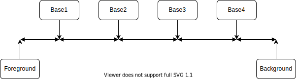

# Colors

This document defines the Zpm Color Standard.

## Installation

### Using zpm

Add `zpm load zpm-zsh/colors` into `.zshrc`

### Using oh-my-zsh

Execute `git clone https://github.com/zpm-zsh/colors ~/.oh-my-zsh/custom/plugins/colors`. Add colors into plugins array in `.zshrc`

### Using antigen

Add `antigen bundle zpm-zsh/colors` into `.zshrc`

### Using zgen

Add `zgen load zpm-zsh/colors` into `.zshrc`

### Note

Load this plugin before others otherwise plugins can't use it

## Usage

```bash
echo $c[reset] Reset all
echo $c[default] Default text color $c[reset]
echo $c[bold] Bold text $c[reset]
echo $c[dim] Dim text $c[reset] # or $c[faint]
echo $c[coursive] Coursive text $c[reset] # or $c[italic]
echo $c[underline] Underlined text $c[reset]
echo $c[blink] Blink text $c[reset] "<- Blink"
echo $c[inverse] Inverse text $c[reset] # or $c[reverse]
echo $c[hidden] Hidden text $c[reset] "<- Hidden text" # or $c[conceal]
echo $c[strike] Strike text $c[reset] # or $c[strikethrough]
echo
echo $c[double_underline] Double underlined text $c[reset]
echo
echo $c[overline] Overlined text $c[reset]
echo
echo BASE COLOR $c[base1] BASE1 COLOR $c[base2] BASE2 COLOR $c[base3] BASE3 COLOR $c[base4] BASE4 COLOR
echo
echo $c[red] Red color $c[reset]
echo $c[orange] Orange color $c[reset]
echo $c[bg_red] Red background $c[reset]
echo $c[bg_orange] Orange background $c[reset]
```


## Aviable modificators

* Self-descriptive modificators: `bold`, `dim`, `coursive`, `underline`, `blink`, `inverse`, `hidden`, `strike`, `double_underline`, `overline`
* Base colors: `base1`, `base2`, `base3`, `base4`
* 6 base colors: `red`, `green`, `blue`, `yellow`, `cyan`, `violet`
* 6 additional colors: `orange`, `chartreuse`, `springgreen`, `dodgerblue`, `purple`, `magenta`
* 6 base background colors with `bg_` prefix: `bg_red`, `bg_green`, `bg_blue`, `bg_yellow`, `bg_cyan`, `bg_violet`
* 6 additional background colors with `bg_` prefix: `bg_orange`, `bg_chartreuse`, `bg_springgreen`, `bg_dodgerblue`, `bg_purple`, `bg_magenta`

## Who we need this?

Many color schemes define very beautiful colors for your terminal emulator. But they have big issue: some CLI apps show output text with same color than your background. So, this text will be invisible.

### Solution?

#### Set-up your terminal emulator colors

1. Do not use **Show bold text in bright colors**, or something like this. Bold should be bold, bright should be bright. Do not mix these options.

2. Your color distribution should be like this, from darker to lighter, or from lighter to darker: background, primary color (base1), lighter variant of primary (base2), secondary (base3), lighter variant of secondary (base4), foreground. <br><br>

3. Set-up 6 terminal colors: red, green, blue, yellow, cyan, violet, and lighter variant of them as 6 additional colors: orange, chartreuse, springgreen, dodgerblue, purple, magenta. This will provide you possibility to set 24 colors, using `$c[modificator]`: 6 base colors + 6 additional colors, 12 colors with dim modification (color + dim).
