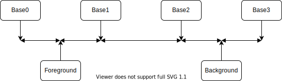

# Colors

This document defines the Zpm Color Standard.

## Usage

### Who we need this?

Many color schemes define very beautiful colors for your terminal emulator. But they have big issue: some CLI apps show output text with same color than your background. So, this text will be invisible.

### Solution?

#### Set-up your terminal emulator colors

1. Do not use **Show bold text in bright colors**, or something like this. Bold should be bold, bright should be bright. Do not mix these options.

2. Your color distribution should be like this, from darker to lighter, or from lighter to darker: primary color (base0), background, lighter variant of primary (base1), secondary (base2), foreground, lighter variant of secondary (base3). 

3. Set-up 6 terminal colors: red, green, blue, yellow, cyan, magenta, and lighter variant of them. This will provide you possibility to set 4 variants of these colors, like `$c[modificator]`: color (color), color with dim modification (color + dim), light color (light_red), light color with dim modification (light_red + dim)

4. You can use 4 base colors for your background (base[0-3] or one of 6 colors)

#### Use this plugin in your cli apps

```bash
echo $c[default] Default text color $c[reset]
echo $c[bold] Bold text $c[reset]
echo $c[dim] Dim text $c[reset]
echo $c[coursive] Coursive text $c[reset]
echo $c[underline] Underlined text $c[reset]
echo $c[blink] Blink text $c[reset] "<- Blink"
echo $c[inverse] Inverse text $c[reset]
echo $c[hidden] Hidden text $c[reset] "<- Hidden text"
echo $c[strike] Strike text $c[reset]
echo
echo $c[double_underline] Double underlined text $c[reset]
echo
echo $c[overline] Overlined text $c[reset]
echo
echo $c[red] Red color $c[reset]
echo $c[light_red] Light red color $c[reset]
echo $c[bg_red] Red background $c[reset]
echo $c[bg_light_red] Light red background $c[reset]
```


Posible colors:

* `base0`, `base1`, `base2`, `base3` only for text,
* `red`, `green`, `blue`, `yellow`, `cyan`, `magenta` and `light_` variants for them for text and backgroud with `bg_` prefix

### Note

Load this plugin before others otherwise plugins can't use it
