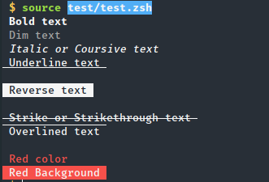

# colors
Enhanced colors for zsh

### Usage

```bash
echo $c_bold Bold text $c_reset
echo $c_dim Dim text $c_reset
echo $c_italic Italic or Coursive text $c_reset
echo $c_underline Underline text $c_reset
echo $c_blink Blink text $c_reset "<- Blink"
echo $c_reverse Reverse text $c_reset
echo $c_hidden Hidden text $c_reset "<- Hidden text"
echo $c_strike Strike or Strikethrough text $c_reset
echo $c_overline Overlined text $c_reset
echo
echo $c[red] Red color $c_reset
echo $c[bg_red] Red Background $c_reset
```


Posible colors: 

* `black`, `white`,
* `red`, `green`, `yellow`, `blue`, `magenta`, `cyan`, `grey` and `light_` variants for them


